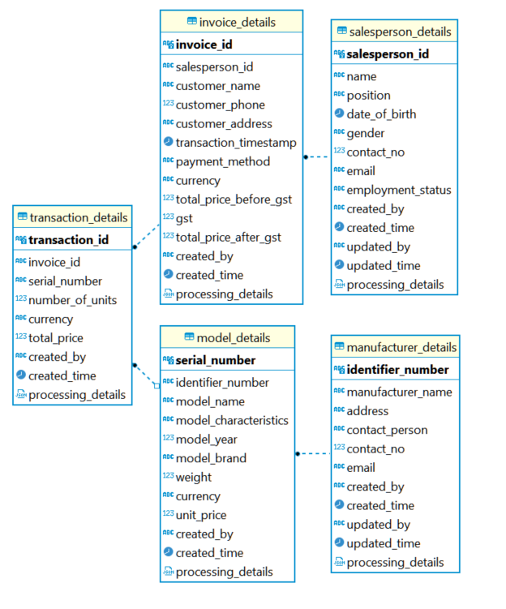

# 2_databases

## _Data model_



### General information

1. The ERD diagram is auto-generated from DBeaver when creating the schemas.The schema is created automatically 
2. This data model does not strictly follow the star or snowflake schema; however, it leans more towards the snowflake schema as it creates a hierarchical structure, minimizes data redundancy, and stores most information only once.
3. It is assume the business is estabished in Singapore.
4. The data model presented above addresses basic needs, and other features such as incentive's packages have not been included due to time constraint. The data model is expected to evolve over time as new requirements and features are identified.

### salesperson_details

1. This table records the details of the salespersons. The salesperson_id represents unique id of the salespersons followed by their personal details, position, and employment status but not limit to them. The reasons to put the employment status and position might be due to the incentive's eligiblity and packages. However, I do not designed the data model for incentive program due to time constraint and that would require further discussion with the stakeholders.
2. The salesperson details table is designed to be slowly changing dimension 1 (SCD 1) due to any change of the salespersons would be updated the existing records. However, it could be SCD 2 for more complicated use case.
3. The audit logs include information about the user who created and updated the records, the timestamp, and the processing details that can be traced back to the original source.

### manufacturer_details

1. This table records the details of the manufacturers. The identifier_number represents the registered number of the business with relevant authorities followed by other manufacturer details but not limit to them.
2. The manufacturers details table is designed to be slowly changing dimension 1 (SCD 1) due to any change of the salespersons would be updated the existing records. However, it could be SCD 2 for more complicated use case.
3. The audit logs include information about the user who created and updated the records, the timestamp, and the processing details that can be traced back to the original source.

### model_details

1. This table records the details of the car models. The serial_number represents the unique id of the car models followed by other car model details but not limit to them.
2. The car model details table is designed to be slowly changing dimension 2 (SCD 2) due to the specification of the car models cannot be change else it would be new models.
3. The upstream would be its manufacturer that linked through manufacturer's identifier number.
4. The audit logs include information about the user who created the records, the timestamp, and the processing details that can be traced back to the original source.

### invoice_details

1. This table records the details of the invoice. The invoice id represents the unique id of the invoice followed by other customers, salespersons, payment details but not limit to them.
2. The invoice details table is designed to be slowly changing dimension 2 (SCD 2) due to the nature of the transactional data.
3. The linkages between transaction and salesperson details table to get the transaction and salesperson details
4. The audit logs include information about the user who created the records, the timestamp, and the processing details that can be traced back to the original source.

### transaction_details

1. This table records the details of the transaction. The transaction id represents the unique id of the transactions followed by other transactional details but not limit to them.
2. The transaction details table is designed to be slowly changing dimension 2 (SCD 2) due to the nature of the transactional data.
3. The transaction get car model details from model details including the unit prices and weight etc. The reason it is designed in this way due to some cases one invoice might have more than one transactions
4. The audit logs include information about the user who created the records, the timestamp, and the processing details that can be traced back to the original source.


## _SQl solution_

1. Output the list of customers and their spending

```sql
select customer_name, SUM(total_price_before_gst) as spending from car_sales.invoice_details group by customer_name; 
```

2. Output the top 3 car manufacturers that customers bought by sales (quatity) and the sales number for it in the current month 

```sql
with monthly_sales_quantity as (
	select manufacturer.identifier_number, manufacturer.manufacturer_name, to_char(transaction_timestamp, 'YYYY-MM') as year_month, sum(transaction.total_price) as quantity from car_sales.manufacturer_details as manufacturer
		join car_sales.model_details as model on (model.identifier_number = manufacturer.identifier_number)
		join car_sales.transaction_details as transaction on (transaction.serial_number = transaction.serial_number)
		join car_sales.invoice_details as invoice on (invoice.invoice_id = transaction.invoice_id)
	group by manufacturer.identifier_number, manufacturer.manufacturer_name, to_char(transaction_timestamp, 'YYYY-MM'))
select * from monthly_sales_quantity where year_month = to_char(current_date, 'YYYY-MM') order by quantity desc limit 10;
```