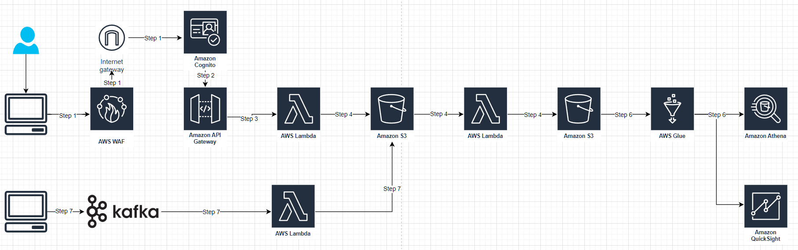

# 3_system_design

## _Data Architecture_

### Step 1: Setup AWS Cognito

1. Create an Amazon Cognito User Pool to manage users, sign-up, and sign-in.
2. Use the Amazon Cognito SDK and integrate it with your web or mobile application to manage user authentication and obtain JSON Web Tokens (JWTs) for making authenticated API calls.
3. Create a WebACL in AWS WAF (Web Application Firewall) to define security rules for your application.
4. Associate the WebACL with your Amazon Cognito authentication endpoints to protect them from various types of attacks.
5. Use the JWTs provided by Cognito to control access to your web application's resources, such as server-side APIs or client-side views.
6. Ensure that the JWTs are included in the Authorization header when making API requests to your server-side APIs.

### Step 2: Setup AWS API Gatway with AWS Cognito

1. In the API Gateway, create an authorizer that uses the Cognito User Pool as an identity source.
2. Configure your API Gateway endpoints to use the Cognito User Pool Authorizer, which will restrict access to authorized users only. The API Gateway will validate the token and grant access to the API if the token is valid and the user has the necessary permissions.

### Step 3: Client uploads image to S3 directly using presigned S3 URL

1. The client’s application makes an HTTP GET request to API Gateway, and the Lambda function generates and returns a presigned S3 URL.
2. The client uploads the image to S3 directly, using the resigned S3 URL.

### Step 4: Images processing

1. When data ingested to first S3 bucket, the lambda function is invoked to process the data and stored the processed image in S3 bucket. (Do note that Lambda has a 15-minute hard limit, and if processing takes longer, it is advised to creating parent and child lambda for the processing, the parents lambda would cut the payload to smaller batch and send asynchronously to child lambda for processing.)

### Step 5: S3 archival and purging:

1. Enable object lifecycle policies on the S3 bucket to automatically purge images and metadata after 7 days.

#### Step 6: Business Intelligence

1. Glue Crawlers are used to discover the data stored in S3 bucket and automatically infer its schema. Crawlers create table definitions in the Glue Data Catalog with associated schema, partition information, and other table properties.
2. The Glue Data Catalog integrates with Amazon Athena and Amazon QuickSight, enabling them to query the cataloged data without needing to manage the underlying metadata themselves.
3. Amazon Athena is used for ad-hoc querying and analysis.
4. Amazon QuickSight is used for creating visualizations and dashboards.

### Step 7: Kafka streaming

1. Develop a Kafka consumer application using a Kafka client library in a programming language that is compatible with AWS SDKs
2. Configure the Kafka cluster and topic details in the consumer application, and set up a polling loop to consume messages from the Kafka topic.
3. For message consumed from Kafka, use the AWS SDK to invoke the Lambda function asynchronously with the processed data as the payload. Make sure to configure the AWS SDK with the necessary credentials and region.

## Best Practices:

### Security and Least Privilege

1. Use Identity and Access Management (IAM) to manage access control for resources. The principle of least privilege is applied through IAM roles and permissions.
2. Use Virtual Private Cloud (VPC) and security groups to secure the environment.

### Scalability and cost optimization:

1. Automatically scale Lambda and API Gateway to meet user demand.
2. Use S3 scale to accommodate data growth.
3. Use S3's intelligent-tiering storage class for cost-effective storage.

### Maintainability:

1. Use CloudFormation templatesto manage the infrastructure as code.
2. Use AWS CodePipeline, CodeCommit, and CodeDeploy for CI/CD, enabling quick deployment and maintenance of the processing scripts.

### Efficient and latency

1. Latency is minimized by using S3 bucket events to trigger Lambda functions.
Elastic and fault tolerant
2. Auto-scaling Lambda functions are designed to be elastic and fault-tolerant.