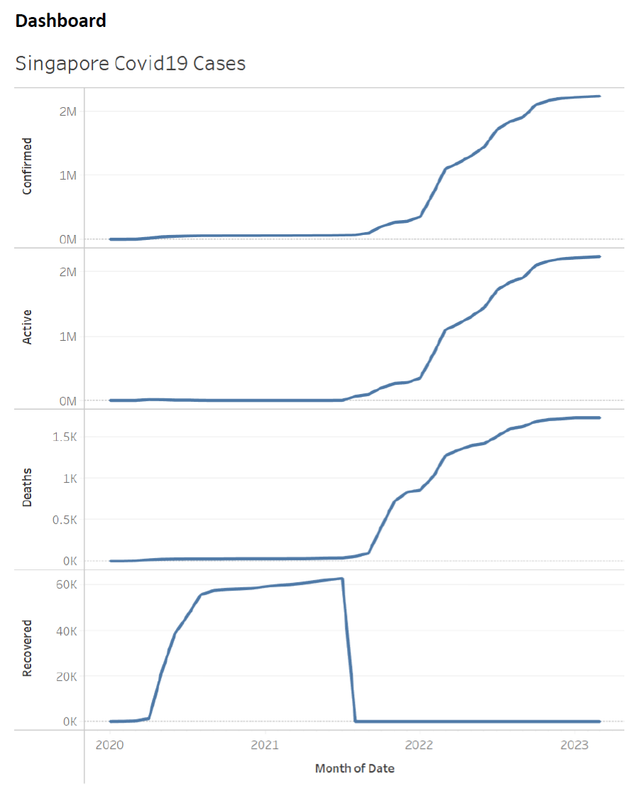

# 4_charts_and_apis

## _Instruction_

1. Open the parent directory of the project in VS code or your preferred code editors and open the **terminal**.

2. Execute **. start.sh** in the terminal to setup the docker environments.

3. Open web browser and go to **<http://localhost:8080/>**
   
   user: airflow
   
   password: airflow

4. Switch on the DAG **4_charts_and_apis** and let it run or create on play button on the actions bar to trigger the DAG manually

5. Read the results
   
   i Read csv file from 4_charts_and_apis
   ii. See the charts and methods explanation below

6. Close the project by executing **. stop.sh** in terminal

## _Charts_

### Pandas plots

### Tableu dashboards

## _Methods explanation_

I triggered **api.py** script in airflow to fetch the covid19 data from the website. Then, I accessed this data in the jupyter notebook for visualization. Besides, I also loaded the same data into Tableu to create a simple dashboard.

## _Note_
1. Assuming that you have already set up a basic development environment and docker desktop on your workstation.
2. This setup is for showcase purpose, not for production deployment