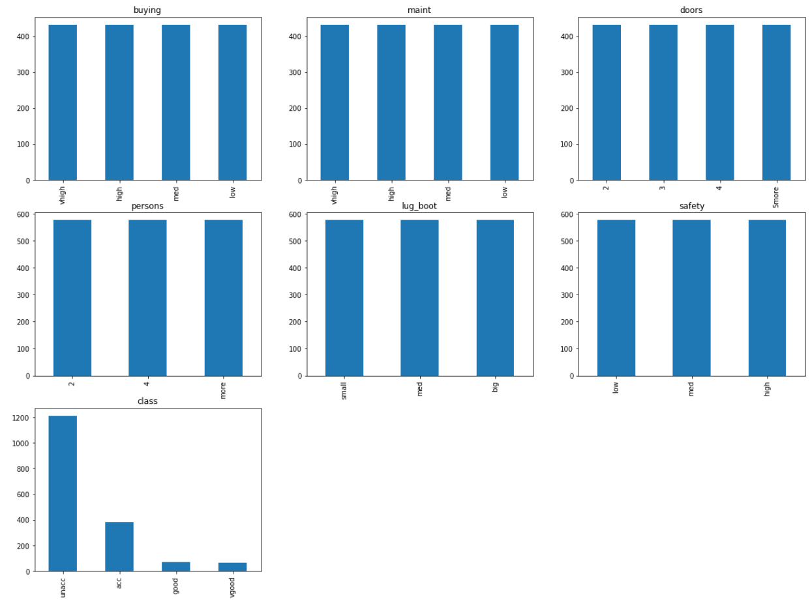
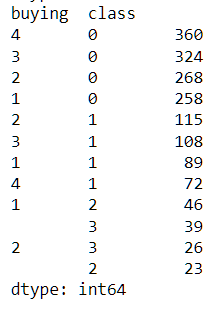
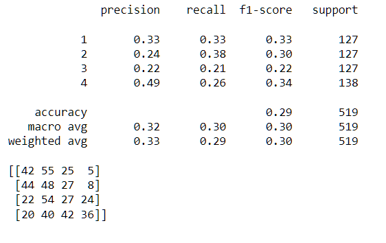

# 5_machine_learning

## _Analysis_

### Feature categorized

The data seems to be unusual balanced for most feature.

### Feature categorizedn by buying price

The "unacc" class seems to have more demand and significantly higher prices.

## _Machine Learning_

**Model:** Decision Tree Classifier

**Criterion:** entropy

**Traning size:** 70%

**Test size:** 30%

### Prediction result

## _Conclusion_

The result is  comparably with only 29% accuracy, which could be attributed to factors such as data quality, underfitting, overfitting or other issue. The data appears to be unusual balanced for most features, Notably, the "unacc" class stands out as having significantly higher prices.

Given more time, I would conduct further analysis to investigate the pattern, perform cross-validation, or explore other predictive models to improve the results.

